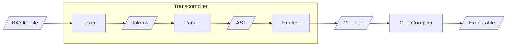

# ZINC

ZINC (stands for "ZINC Is a Normal Compiler") is a transcompiler that converts
some of the BASIC programming language syntax into C++.



As shown in the flowchart, the transcompiler has $3$ stages. The first one is a lexer that reads the file whose path is supplied as an argument. The words there are separated and tokens are identified, so that some words become keywords while others become identifiers or operators, and so on.

The extracted tokens are then passed to the parser which converts sequence of tokens into an AST (i.e. Abstract Syntax Tree). It also checks for some syntax errors before passing the tree to the next stage.

The final stage is the emitter which takes in complete statements and emits their corresponding C++ statements. The final output is saved to a file with the same name as the input file with ".cpp" extension.

Finally, if the provided script is used, the output file will be formatted using `clang-format`, compiled using `make`, and run eventually.

## Usage

To compile and run the compiler, just use the script as follows:

```bash
$ ./run.sh -r -- <filename>.ZINC
```

## Coding, syntax and supported commands
### Operators 
The following operators are supported :
 - Greater than or equal `>=`
 - Equal equal `==`
 - Equal `=`
 - Greater than `>`
 - Less than `<`
 - Less than or equal `<=`
 - Not equal `!=`
 - Addition(Plus)  `+`
 - Subtraction(Minus) `-`
 - Division(Slash) `/`
 - Multiplication(Asterisk) `*`
## 
### Comments 
`# write your comment like this :D`   
`# one line after the other`
##
### `PRINT`
for printing strings , literals or variables.

***examples:***
```
PRINT 13
PRINT "HELLO WORLD!"
```
### `LET`
to denote an expression whether it involves defining a variable , assignment or a mathematical expression.
```
LET a = 12
LET b = a + 1
LET c = a + b 
PRINT a
PRINT b
PRINT c
```

> Strings and string assignment are not supported yet    
> Something like `LET A = "Hello there"` will not work

### `INPUT`
accept input from the user into a variable, the `INPUT`command also handles variable definition for you.
```
PRINT "Please enter a number :"
INPUT a
PRINT "the number you entered is : "
PRINT a
```
### `IF` , `THEN` & `ENDIF`
```
#Simple conditional program
PRINT "Please enter a number"
INPUT A 
IF A >= 0 THEN
PRINT "The number you entered is positive"
ENDIF
```
### `ELSE`
```
# with else added
PRINT "Please enter a number"
INPUT A 
IF A > 0 THEN
PRINT "The number you entered is positive"
ELSE
PRINT "The number you entered is negative"
ENDIF
```
### `ELSEIF`
```
# with else if added
PRINT "Please enter a number"
INPUT A 
IF A > 0 THEN
PRINT "The number you entered is positive"
ELSEIF A < 0 THEN
PRINT "The number you entered is negative"
ELSE
PRINT "The number you entered is Zero"
ENDIF
```
### `WHILE` , `REPEAT` & `ENDWHILE`
```
# calculating the sum from 1 till 10
LET A = 1
LET SUM = 0 
WHILE A <= 10 REPEAT
LET SUM = SUM + A 
LET A = A + 1
ENDWHILE
PRINT "The sum is "
PRINT SUM
```
### `GOTO` & `LABEL`
`LABEL` identifies a location within source code that `GOTO` can jump to.
```
# a program that won't print anything when 0 is entered 
PRINT "Please enter any number other than zero"
INPUT num 
IF num == 0 THEN
GOTO END
ENDIF
# If the num is Zero
# this line will be skipped because of GOTO 
PRINT "The number is not Zero"
LABEL END
```

> Please note that you shouldn't have any variable definitions that `GOTO` can jump over, otherwise an error will be raised by the compiler

##
More examples are available in the repository , feel free to play around and give them a try :D.
